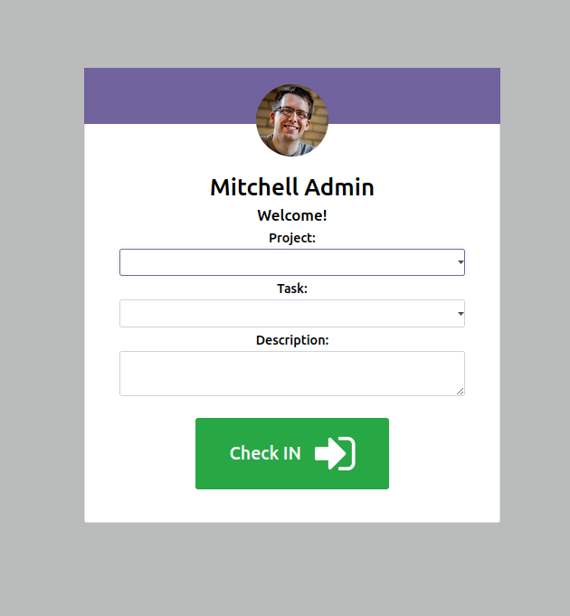
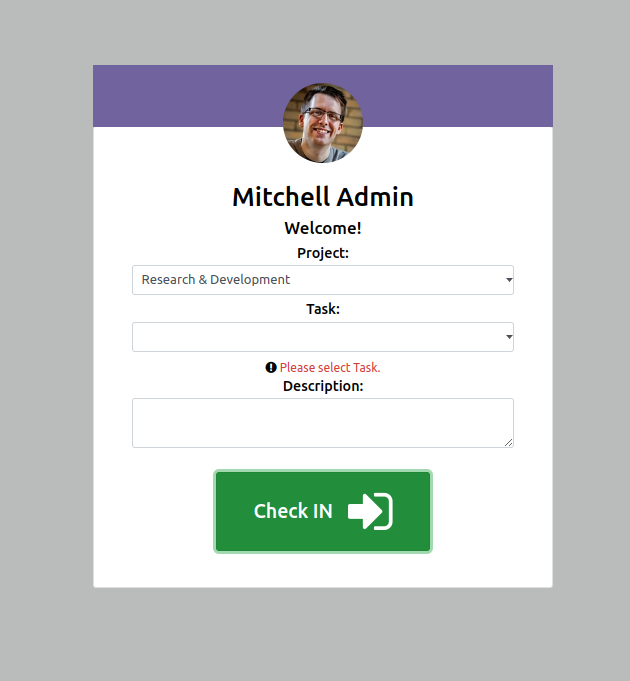

#Project Task Attendance
#V16.0.0.2
This module aims to enhance Odoo's Attendance module with the following features:

Select Project: Users can choose a specific project during check-in.
Select Project Task: Users can select a task related to the chosen project.
Write Descriptions: Users can add descriptions for their activities during both check-in and check-out.
User Interface Adjustments: Modify the check-in/check-out screen to include dropdown menus for projects and tasks. Ensure dynamic linkage between project and task fields, where selecting a project filters available tasks. Provide a text box for entering descriptions.
Data Validation

